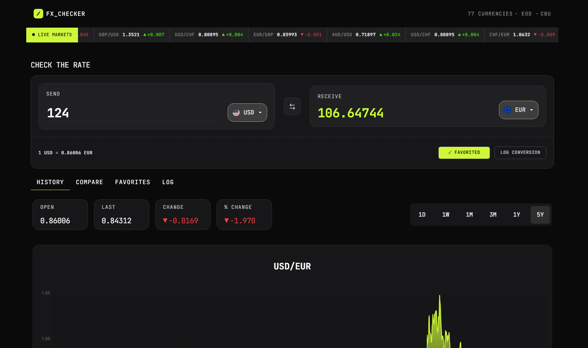

# Exchange Converter

Exchange Converter is a website where you can convert different amounts of money to particular currencies.  

## Table of contents

- [Overview](#overview)
  - [The project](#the-project)
  - [Screenshot](#screenshot)
  - [Links](#links)
- [My process](#my-process)
  - [Built with](#built-with)
  - [Continued development](#continued-development)
  - [Useful resources](#useful-resources)
- [Author](#author)

## Overview

### The project

Users are able to:

- View the optimal layout depending on their device's screen size
- See hover states for interactive elements
- Choose base and quote currencies
- Swap currencies' places, so quote becomes base and base become quote
- Log conversions
- Add current pair to favorites (data is stored in local storage)
- Observe history chart for chosen currencies
- See live market of currencies
- 
### Screenshot

### Links

- Repo URL: [Add solution URL here](https://github.com/paliss9001/exchange-converter)
- Live Site URL: [Add live site URL here](https://paliss9001.github.io/exchange-converter/)

## My process

### Built with

- Semantic HTML5 markup
- CSS custom properties
- Flexbox
- CSS Grid
- [React](https://reactjs.org/) - JS library
- SASS (SCSS)
- BEM, Adaptive design
- Figma
- Vite
- REST API
- Frankfurt API

If you want more help with writing markdown, we'd recommend checking out [The Markdown Guide](https://www.markdownguide.org/) to learn more.

**Note: Delete this note and the content within this section and replace with your own learnings.**

### Continued development

Based on the feedback I have recevied so far, I want to implement a formatter, so users can comfortable see how much money they are planning to convert and how much they get.

I also want to add a little more smoothnes to the website, such as adding some steady loading animations until history or chart loads 

### Useful resources

- [Recharts](https://react.dev/reference/react/useEffect) - this is probably the best library for making charts with react with well-written documentation.  

- [Frankfurt](https://frankfurter.dev/javascript/) - This is the backbone of my app that provides essential data about currencies.

## Author

- Personal Website - [Ibrohim Baxodirov](https://paliss9001.github.io/ibrohim_baxodirov/)
- Medium - [@ibrohimbahodirov90](https://medium.com/@ibrohimbahodirov90)
- LinkedIn - [Ibrohim Baxodirov](https://www.linkedin.com/in/ibrohim-baxodirov-a142632b1/)
- Email - ibrohimbahodirov90@gmail.com
